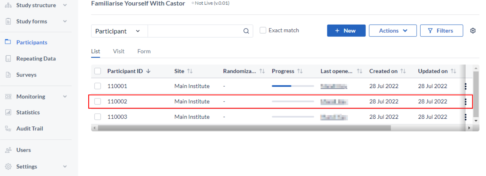
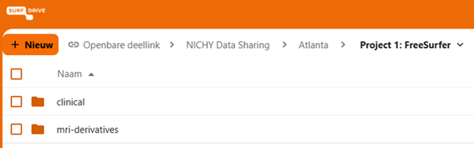

# Data Sharing for NICHY FreeSurfer 7

## Important things to consider
Once you have completed all the steps, your derived data is ready to be shared with the server in Amsterdam, where it will be accessible to the NICHY core team and project leads (following opt-in). All data will remain on this server. Before transferring, please take the following steps:

- **Review the .tsv and Excel files to confirm completeness**. Verify that all participants are included, there are no missing or unexpected values, and that quality assessment scores have been assigned to each ROI and participant.
- If your site has a preferred data transfer method (different from the one described below), please let us know and we will do our best to accommodate it. Be sure to confirm this with your PI and consult your data transfer agreement beforehand.

## Data to be shared

The following data will be shared with the Amsterdam server as part of this project:

### MRI Outcomes (nipoppy workflow)

FreeSurfer output (5 spreadsheets)

From: `<dataset_root>/derivatives/freesurfer/7.3.2/idp/fs_stats-0.2.1/`

- Surface area: `fs7.3.2-aparc-area.tsv`

- Thickness: `fs7.3.2-aparc-thickness.tsv`

- Curvature: `fs7.3.2-aparc-meancurv.tsv`

- Subcortical volume: `fs7.3.2-aseg-volume.tsv`

From: `<dataset_root>/derivatives/freesurfer_subseg/1.0/idp/fs_subseg_stats-0.2/`

- Subsegmentations: `subsegmentation_volumes.tsv`

Quality control output (2 spreadsheet, optionally .png files)

- Cortical quality assessment scores

- Subcortical quality assessment scores

- Quality control .png files (if authorized)

## Clinical and Demographic Data

Please share all available clinical and demographic data using one of the following three options. It is important for us to receive as comprehensive a dataset as possible so we can identify which variables are available across NICHY sites and conduct analyses with maximum clinical detail.

### Option 1: Sharing an existing spreadsheet

If your site already has a spreadsheet containing the clinical and demographic variables for all participants, you can share this directly. Please make sure the file is in a machine-readable format: a single CSV or TSV file is preferred, with all variables as columns and all participants as rows. Avoid Excel files with multiple tabs, merged cells, or comments. For this option, we ask you to create a data dictionary using Neurobagel. We are currently finalizing our list with variables of interest and instructions on how to use Neurobagel. More information soon!

### Option 2: Manual entry via Castor (prospective sites or small N)

If your site is just getting started or has a relatively small number of participants, you can enter your data directly into our Castor database. More information about data entry using Castor can be found [here](https://helpdesk.castoredc.com/hc/en-us/articles/27071695733277-Doing-data-entry-in-CDMS). Please send us an email and we will provide you with access and instructions. No data dictionary is needed for this option.

### Option 3: EU-NN data sharing

If your participants are also included in the EU-NN database, you can request an export of the relevant data directly from the EU-NN. This requires an export of your EU-NN data accompanied by a reference file with matching MRI IDs, as well as some more data that is not included in the EU-NN. Please reach out to the NICHY core team to arrange this. 

## Data upload via SURFdrive

We provide a secure and encrypted method to send your data using [SURFdrive, SURF's community cloud storage service for Dutch education and research](https://www.surf.nl/en/services/storage-data-management/surfdrive).

Using the personalized link you received via email, please upload your derived MRI data and (depending on the clinical data option you selected above) the corresponding clinical data. Once uploaded, we will securely transfer the data to our servers for statistical analysis within the NICHY study.

