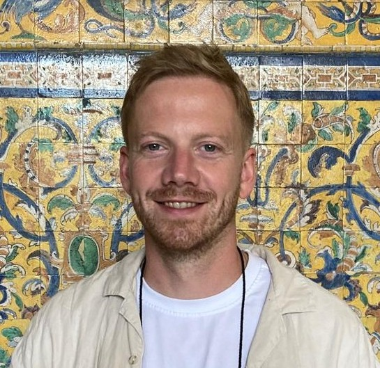

# NICHY Analysis Team

Meet the people behind the first analysis!

<!-- 
The section below uses a special mix of markdown and HTML to make pretty cards.
To add another person, copy the following format and add it between the 
 
 tags:

COPY THIS TO ADD ANOTHER PERSON:

- { width="80" } **[Member One](https://personal.website.org/of-member-1)**  
  City University, The Country

 -->

- { width="80" } **[Eva van Heese](https://www.amsterdamumc.org/en/research/researchers/eva-van-heese.htm)**  
  Amsterdam UMC, Amsterdam, the Netherlands

- { width="80" } **[Keetje Voogd](https://www.linkedin.com/in/keetje-voogd/?originalSubdomain=nl)**  
  Amsterdam UMC, Amsterdam, the Netherlands

- { width="80" } **[Niels de Joode](https://www.linkedin.com/in/niels-de-joode-aab451a3/?originalSubdomain=ca)**  
  Concordia University, Montreal, Canada

