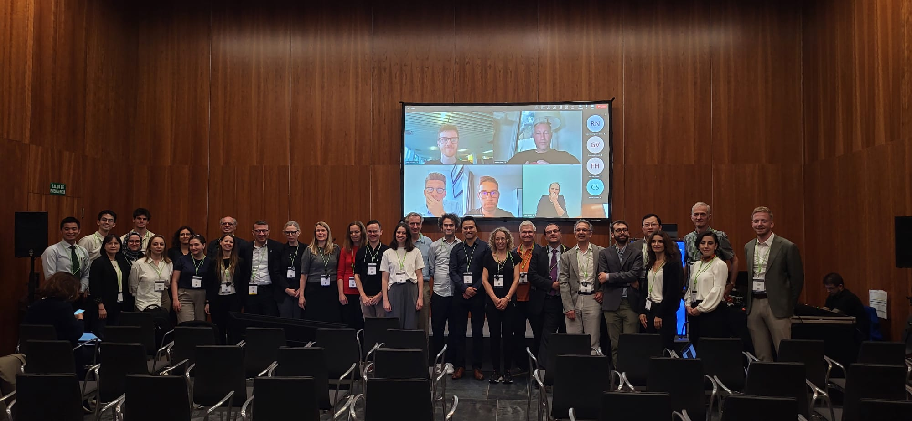

## Joining the consortium
All participating sites are welcome to contribute data to NICHY projects if their data meet the following requirements: 

- Diagnosis of NT1, NT2, **or** IH according to the International Classification of Sleep Disorders, Third Edition (ICSD-3), **or** healthy control status
- Available structural and/or functional MRI data 
- There is **no minimum** number of participants required per site or scanner.

Participating sites retain **full ownership** of their data. Responsibility for obtaining ethical approval, informed consent, and data protection compliance, rests with each participating site. 

NICHY provides an open framework for collaboration, allowing sites to propose new studies while ensuring data privacy and adherence to local regulations.

Interested in joining NICHY? Please reach out to the working group chairs at yd.vanderwerf@amsterdamumc.nl and tt.dangvu@concordia.ca!

