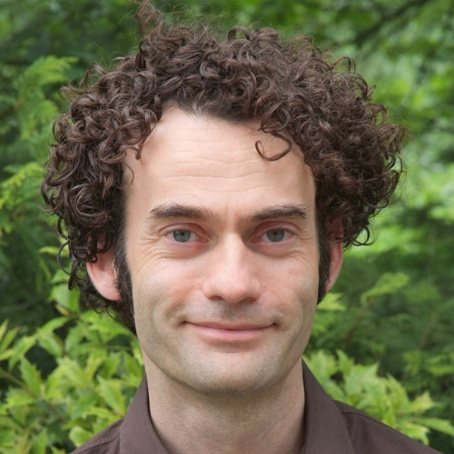

# NICHY Steering Committee

Meet the people in the steering committee!

<!-- 
The section below uses a special mix of markdown and HTML to make pretty cards.
To add another person, copy the following format and add it between the 
 
 tags:

COPY THIS TO ADD ANOTHER PERSON:

- { width="80" } **[Member One](https://personal.website.org/of-member-1)**  
  City University, The Country

 -->

- { width="80" } **[Ysbrand van der Werf (Co-lead)](https://www.amsterdamumc.org/en/research/researchers/ysbrand-van-der-werf.htm)**  
  Amsterdam UMC, Amsterdam, the Netherlands

- { width="80" } **[Thanh Dang-Vu (Co-lead)](https://www.concordia.ca/faculty/thanh-dang-vu.html)**  
  Concordia University, Montréal, Canada

- { width="80" } **[Jari Gool](https://pure.amsterdamumc.nl/en/persons/jari-gool)**  
  Amsterdam UMC, Amsterdam | Sleep-Wake Center SEIN, Heemstede | LUMC, Leiden The Netherlands

- { width="80" } **[Stine Knudsen-Heier](https://www.ous-research.no/home/nevsom/Members/18873)**  
  Oslo University Hospital, Oslo, Norway

- { width="80" } **[Lynn Marie Trotti](https://med.emory.edu/directory/profile/?u=LBECKE2)**  
  Emory University, Atlanta, United States

- { width="80" } **[Sophie Schwartz](https://neurocenter-unige.ch/research-groups/sophie-schwartz/)**  
  Université de Genève, Geneva, Switzerland

- { width="80" } **[Rolf Fronczek](https://www.lumc.nl/afdelingen/neurologie/r-fronczek/)**  
  Sleep-Wake Center SEIN, Heemstede | LUMC, Leiden The NetherlandsAmsterdam UMC, Amsterdam, the Netherlands

- { width="80" } **[Gert Jan Lammers](https://www.lumc.nl/en/afdelingen/neurologie/gj-lammers/)**  
  Sleep-Wake Center SEIN, Heemstede | LUMC, Leiden The Netherlands

